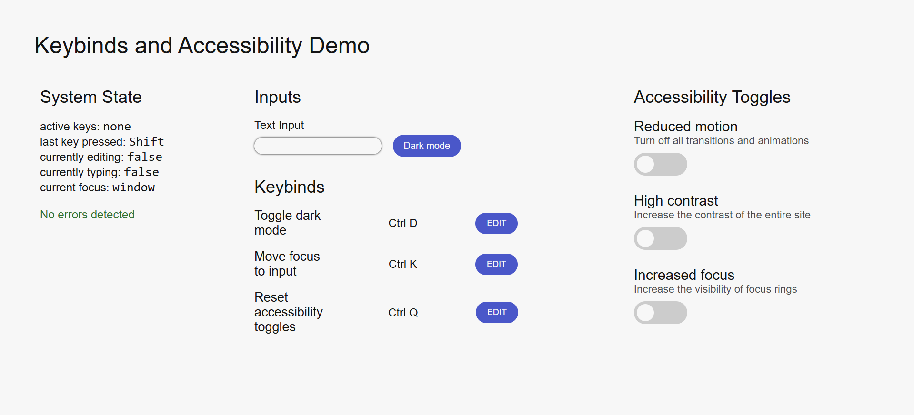

# Keybinds and Accessibility System Demo


A demo showcasing a shortcut customization system and accessibility toggles.

## Table Of Contents
1. [Installation](#installation)
2. [Usage](#usage)
3. [Tech Stack](#tech-stack)
4. [License](#license)

## Installation
```
git clone https://github.com/logicalPanda2/keybinds-system-demo.git
```

## Usage
Navigate to the `index.html` file in the `src` folder, then open it directly in your browser.

## Tech Stack
Built entirely in HTML, CSS, and vanilla JavaScript.

## License
This project is licensed under the <a href="LICENSE.txt">MIT License</a>.
